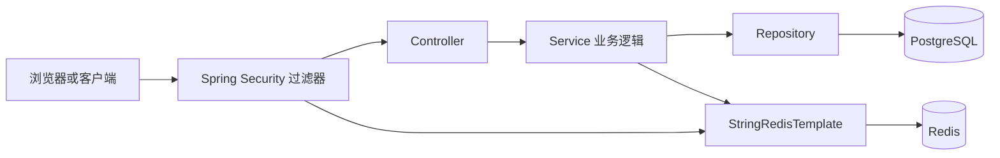

# Redis 从零到项目实战

以 ITMS-BD 的 JWT 黑名单、登录失败计数和交通数据缓存为主线

更新时间：2026-09-13。适用读者：有 C++ 基础，正在学习 Java/Spring Boot，准备后端或服务端面试。

这份教程的目标是让你亲手运行命令、读懂项目方法，并解释一个设计为什么成立、在什么情况下会失效。先理解三条业务链路，再学习 Lua、分布式锁和 Stream；每天都留下命令结果与自己的解释。

## 阅读导航

| 阶段 | 章节 | 学完应交付什么 |
| --- | --- | --- |
| 建立概念 | 0～3 | 画出 Spring Boot、PostgreSQL、Redis 的关系，独立运行基本命令 |
| 读懂代码 | 4～7 | 讲清 StringRedisTemplate、黑名单、计数器、缓存的调用链 |
| 完成实验 | 8～9 | 跑通实验脚本，解释 Lua 原子性、锁与 Stream 的用途 |
| 处理故障 | 10～11 | 识别缓存问题，说明持久化、内存与集群的边界 |
| 准备面试 | 12～15 | 完成学习计划、验收清单、项目介绍与针对性追问 |

配套实验入口：[实验说明](E:/BaiduNetdiskDownload/3D/resume_work/source_repos/itms-bd/docs/redis-lab/README.md)、[自动验证脚本](E:/BaiduNetdiskDownload/3D/resume_work/source_repos/itms-bd/docs/redis-lab/verify.ps1)。基础实验只需要 Redis 与 Docker；不需要 PostgreSQL、Kafka、前端或模型 API 密钥。

## 0. 先校正项目事实

### 0.1 本教程以什么为准

项目实际路径：[ITMS-BD](E:/BaiduNetdiskDownload/3D/resume_work/source_repos/itms-bd)。当前后端为 Java 17、Spring Boot 3.2.0，数据库为 PostgreSQL，Redis 客户端通过 Spring Data Redis 使用 `StringRedisTemplate`，底层默认驱动为 Lettuce。Redis 容器镜像是 `redis:7-alpine`。

源码中存在某个方法，说明实现已经落盘；功能是否正确，还要观察测试结果；某段代码由谁完成，应结合实际开发、修改和验证过程说明。面试可以准确介绍本轮补充的 Redis 模块，旧项目中来源不明的模块仍按实际参与范围介绍。

### 0.2 当前真实能力与学习目标

| 内容 | 当前代码行为 | 本教程的定位 |
| --- | --- | --- |
| JWT 黑名单 | 登出调用 Redis 写入摘要 Key，过滤器校验有效 JWT 后查询黑名单 | 真实业务，有异常处理缺口 |
| 登录失败计数 | 现有且启用的账户密码错误时 INCR；首次设置 10 分钟 TTL；达到 5 次改变错误提示；成功登录删计数 | 计数已实现，完整封禁尚待补齐 |
| 实时交通缓存 | 两个 JSON String Key，各 5 秒 TTL；读 miss 回源数据库，写入路径尝试删除缓存 | 真实业务，存在并发与失效边界 |
| Redis 故障回退 | 交通缓存方法捕获读写异常；认证查询黑名单异常没有同样的降级 | 按方法分析，避免推广为全站能力 |
| Lua、Redis 锁、Stream | ITMS 当前业务没有这些实现 | 独立练习、后续扩展 |
| Redisson | ITMS 当前未接入；InterviewGuide 使用的是另一套客户端 | 两个项目分开讲解 |
| 自动业务测试 | 本次执行 `mvn test` 显示 `No tests to run.` | Maven 成功与业务用例通过是两项证据 |

**修正上一版教程：**“失败 5 次后封禁 10 分钟”“全站 Redis 故障可回源”“数据最多陈旧 5 秒”“业务测试已通过”都超出了当前证据。下面会用源码解释原因。

### 0.3 源码阅读索引

| 阅读对象 | 从哪个方法开始 | 应回答的问题 |
| --- | --- | --- |
| [RedisAuthServiceImpl.java](E:/BaiduNetdiskDownload/3D/resume_work/source_repos/itms-bd/backend/src/main/java/com/itms/service/impl/RedisAuthServiceImpl.java) | `revokeToken`、`recordLoginFailure` | 存什么、何时过期、失败时怎样处理？ |
| [AuthServiceImpl.java](E:/BaiduNetdiskDownload/3D/resume_work/source_repos/itms-bd/backend/src/main/java/com/itms/service/impl/AuthServiceImpl.java) | `login`、`logout` | 计数器在哪里被读取或修改？ |
| [SecurityConfig.java](E:/BaiduNetdiskDownload/3D/resume_work/source_repos/itms-bd/backend/src/main/java/com/itms/config/SecurityConfig.java) | `jwtAuthenticationFilter` | 黑名单如何影响受保护接口？ |
| [AuthController.java](E:/BaiduNetdiskDownload/3D/resume_work/source_repos/itms-bd/backend/src/main/java/com/itms/controller/AuthController.java) | `logout` | HTTP 请求如何进入业务层？ |
| [JwtUtil.java](E:/BaiduNetdiskDownload/3D/resume_work/source_repos/itms-bd/backend/src/main/java/com/itms/util/JwtUtil.java) | `generateToken`、`parseToken` | 签名与过期时间如何校验？ |
| [TrafficDataServiceImpl.java](E:/BaiduNetdiskDownload/3D/resume_work/source_repos/itms-bd/backend/src/main/java/com/itms/service/impl/TrafficDataServiceImpl.java) | `getRealTimeData`、`getIntersectionSummary`、`saveTrafficData` | 缓存命中、回源、聚合和删除有什么先后关系？ |
| [application.yml](E:/BaiduNetdiskDownload/3D/resume_work/source_repos/itms-bd/backend/src/main/resources/application.yml) | `spring.data.redis` | 连接谁、超时多久？ |
| [docker-compose.yml](E:/BaiduNetdiskDownload/3D/resume_work/source_repos/itms-bd/docker-compose.yml) | `redis` 服务 | AOF 与数据卷分别做什么？ |

## 1. 你到底在学什么

### 1.1 Java、Spring Boot、Redis、数据库的关系

Java 是编写后端逻辑的语言。Spring Boot 帮助配置并启动 Java 应用。Redis 和 PostgreSQL 是独立运行的数据服务，后端通过网络访问它们。



在 ITMS 中，PostgreSQL 保存用户与交通数据；Redis 保存加速查询的副本、短期计数和 Token 吊销状态。交通缓存丢失后可以重建，但吊销记录丢失可能使尚未过期的 Token 再次获得访问资格，所以不同 Key 的故障策略应分别设计。

### 1.2 用 C++ 的已有知识理解

| C++ 中熟悉的概念 | Redis/Java 中对应的理解 | 需要额外注意 |
| --- | --- | --- |
| `unordered_map<string, T>` | 用 Key 找 Value | Redis 在独立进程，访问涉及网络和序列化 |
| 多进程共享数据 | 多台应用访问同一个 Redis | 跨应用实例共享；本地静态 Map 只属于当前进程 |
| `atomic<long>` | Redis `INCR` | 单命令原子，但两次网络命令之间可能插入其他操作 |
| 对象转字节后写 socket | Java 对象转 JSON 后写 Redis | Redis String 保存字节，业务负责解释内容 |
| RAII/作用域释放锁 | Java `try/finally` 释放锁 | Redis 锁还要处理租期、所有权、进程失联 |
| 构造函数接收依赖 | Spring 构造器注入 | 容器创建并传入对象，测试时可注入替身 |

Redis 快主要因为数据常驻内存、数据结构适合目标操作、事件驱动处理网络请求。它仍有网络往返、序列化和排队成本；缓存一个很便宜的查询未必收益明显。

**自测：** 两个 Spring Boot 实例分别执行 `new HashMap<>()`，会共享内容吗？不会。它们连接同一 Redis 实例和逻辑库、使用同一 Key 时，才访问同一份 Redis 数据。

## 2. 建好最小实验环境

### 2.1 推荐：独立 Redis 学习环境

配套目录使用独立 Compose 项目，没有宿主端口映射，不占用 ITMS 的 6379，也不启动业务服务。开启 Docker Desktop 的 Linux 引擎后，在 PowerShell 执行：

```powershell
Set-Location 'E:\BaiduNetdiskDownload\3D\resume_work\source_repos\itms-bd\docs\redis-lab'
docker version
docker compose -f compose.yml up -d
docker compose -f compose.yml exec -T redis redis-cli PING
docker compose -f compose.yml exec redis redis-cli
```

`PING` 的预期结果是 `PONG`。最后一行进入 Redis 交互终端，提示符类似 `127.0.0.1:6379>`。第 3 章的 Redis 命令在这个提示符后输入；离开使用 `exit`。

启动失败时先区分层次：Docker API 连接失败说明引擎尚未就绪；镜像拉取失败说明镜像/网络问题；Redis 连接失败再查看 `docker compose -f compose.yml logs --tail=60 redis`。

### 2.2 观察已经部署的 ITMS Redis

在 ITMS 根目录执行以下只读操作：

```powershell
Set-Location 'E:\BaiduNetdiskDownload\3D\resume_work\source_repos\itms-bd'
docker compose ps redis
docker compose exec -T redis redis-cli PING
docker compose exec -T redis redis-cli --scan --pattern 'itms:traffic:*'
docker compose exec -T redis redis-cli PTTL itms:traffic:realtime
```

学习 Redis 本身时优先使用 2.1；验证应用时再访问 ITMS 实例。两个环境数据独立，实验中的 Lua 脚本不会自动接入 Java 服务。

### 2.3 地址为什么经常配错

| Java 在哪里运行 | Redis 在哪里 | 地址 |
| --- | --- | --- |
| Windows 宿主机 | ITMS 容器映射 6379 | `localhost:6379` |
| ITMS backend 容器 | 同 Compose 的 redis 服务 | `redis:6379` |
| 学习容器内的 redis-cli | 当前学习容器 | `localhost:6379` |

容器内的 `localhost` 指该容器自身。ITMS 的 Compose 注入 `SPRING_DATA_REDIS_HOST=redis`，本地配置默认 `localhost`。项目连接超时和命令超时均为 2 秒；这是超时设置，并非整个请求最多耗时 2 秒，多个 Redis 操作可能累计等待。

## 3. 先学会 String、Key 与 TTL

### 3.1 第一个 Key

在学习 Redis 的交互终端执行：

```redis
SET learn:hello redis
GET learn:hello
TYPE learn:hello
EXISTS learn:hello
DEL learn:hello
EXISTS learn:hello
```

依次应看到 `OK`、`redis`、`string`、`1`、`1`、`0`。冒号只是命名习惯，不创建文件夹。Key 通常按照“项目:模块:对象ID”命名，方便排查和避免冲突。

### 3.2 TTL 是有效期限

```redis
SET learn:ttl hello EX 30
TTL learn:ttl
PTTL learn:ttl
EXPIRE learn:ttl 60
TTL learn:ttl
```

`EX` 单位是秒，`PX` 是毫秒，`TTL` 返回秒，`PTTL` 返回毫秒。正数是剩余时间，`-1` 是存在但没有到期时间，`-2` 是 Key 不存在。

```redis
SET learn:ttl changed
TTL learn:ttl
```

普通 `SET` 覆盖已有值默认清除原 TTL，此时返回 `-1`。希望重新设置期限就使用 `SET ... EX/PX`；希望保留现有期限可以使用 `KEEPTTL`。项目的缓存写入和吊销写入都把值与期限放进一次带 TTL 的写操作。

过期表示后续读取不再返回该值；内存回收由惰性删除和定期清理配合完成。TTL 到零与操作系统层面的内存立即下降不是同一事件。

### 3.3 JSON 仍然是 String

```redis
SET learn:traffic '{"intersectionId":"A01","vehicleCount":120}' EX 30
TYPE learn:traffic
GET learn:traffic
```

结果类型仍是 `string`。Java `Map` 转成 JSON 存入 Redis，不会自动变成 Redis Hash。

### 3.4 计数器

```redis
DEL learn:failures
INCR learn:failures
EXPIRE learn:failures 600
INCR learn:failures
GET learn:failures
TTL learn:failures
```

首次 `INCR` 从不存在的 Key 得到 `1`；第二次得到 `2`，自增保留 TTL。Redis 的整数计数使用有符号 64 位整数；超范围或非整数字符串会报错。

**今天必须掌握的区别：** `INCR` 自身是原子操作；`INCR` 之后再发一个 `EXPIRE`，整个组合存在中断窗口。

### 3.5 查看与清理

```redis
SCAN 0 MATCH learn:* COUNT 100
MEMORY USAGE learn:traffic
UNLINK learn:hello learn:ttl learn:traffic learn:failures
```

`SCAN` 返回游标和一批 Key，继续传返回游标，直到游标为 `0`。`COUNT` 是工作量提示；一次结果不是全集，并发修改下可能出现重复项。`UNLINK` 解除 Key 后将较重的内存释放交给后台，适合较大的值；练习只清理明确列出的学习 Key。

**本章验收：** 不看教程创建一个 15 秒 Key，读取 TTL，解释 `-1/-2`，再说明 JSON 与 Redis String 的关系。

## 4. 看懂 Java 如何发送 Redis 命令

### 4.1 Spring 自动配置负责什么

`spring-boot-starter-data-redis` 提供 Spring Data Redis 及默认 Lettuce 客户端依赖。Spring Boot 根据连接配置创建连接工厂和 `StringRedisTemplate` Bean。

```java
@Service
@RequiredArgsConstructor
public class RedisAuthServiceImpl implements RedisAuthService {
    private final StringRedisTemplate redis;
    private final JwtUtil jwtUtil;
}
```

`@Service` 让 Spring 管理该对象；`@RequiredArgsConstructor` 由 Lombok 生成含这两个 `final` 字段的构造器；Spring 把 Redis 模板和 JWT 工具注入进来。可以把它理解为由框架替你完成构造函数参数装配。

### 4.2 Java 方法与 Redis 语义

| 项目调用 | Redis 语义 | 需要记住 |
| --- | --- | --- |
| `redis.opsForValue().get(key)` | GET | 没有值返回 null |
| `set(key, value, Duration.ofSeconds(5))` | 带到期参数的 SET | TTL 与值一起写入 |
| `set(key, "1", remainingMs, MILLISECONDS)` | 毫秒期限写入 | Java 重载明确单位 |
| `increment(key)` | INCR | String 内保存可解析的整数 |
| `redis.hasKey(key)` | EXISTS | Java 返回包装类型 Boolean |
| `redis.expire(key, duration)` | EXPIRE/PEXPIRE 对应语义 | 给现有 Key 设置期限 |
| `redis.delete(key)` | DEL | 删除缓存或计数 |
| `setIfAbsent(key, value, duration)` | SET NX 加期限 | 后续锁练习使用，当前业务未调用 |

表中是语义对应；具体发送的变体由 Spring Data Redis 的版本和时间单位决定，抓包或客户端追踪可以验证。

`Boolean.TRUE.equals(...)` 同时处理 `true`、`false` 与 `null`，避免直接拆箱的空指针。`StringRedisTemplate` 的普通 Key/Value 使用字符串序列化，便于 CLI 观察；JWT 摘要、计数、JSON 都能通过同一模板保存。

### 4.3 对象为什么要序列化

项目缓存的过程是：

```text
List<Map<String, Object>>
  → ObjectMapper.writeValueAsString
  → JSON 文本
  → Redis String
  → ObjectMapper.readValue + TypeReference
  → Java 集合
```

`TypeReference<List<Map<String,Object>>>` 保留反序列化需要的容器类型信息，但 Map 中的 `Object` 并不保留原对象的所有 Java 类型。数值和时间字段在缓存命中/未命中两条路径上可能产生不同 Java 表示，应比较最终 HTTP JSON，必要时使用明确的 DTO 约定格式。

**本章验收：** 自己解释 `redis.opsForValue().set(key, json, Duration.ofSeconds(5))` 中模板、Value 类型、序列化与过期单位的含义。

## 5. ITMS 第一条链路：JWT 黑名单

### 5.1 请求路径

```text
POST /api/auth/logout
  -> AuthController.logout(Authorization)
  -> AuthServiceImpl.logout
  -> RedisAuthServiceImpl.revokeToken
  -> JwtUtil.parseToken 得到 expiration
  -> SET itms:auth:revoked:{sha256(token)} 1 PX 剩余毫秒
```

后续受保护请求经过 `SecurityConfig.jwtAuthenticationFilter`：先校验 JWT 签名和过期时间，再调用 `isTokenRevoked`。Key 保存的是 SHA-256 摘要，Redis 中没有 Token 原文；TTL 等于 Token 剩余有效期，过期后由 Redis 回收。

### 5.2 为什么 JWT 还需要 Redis

JWT 的签名和过期校验可以在本地完成，但签发后通常缺少主动撤销入口。黑名单提供一个短期的撤销状态：签发服务仍然无状态，登出动作把状态写入共享 Redis。代价是每次受保护请求多一次 Redis 读取，Redis 故障还会影响认证过滤器。

### 5.3 现有实现的边界

- `revokeToken` 捕获的 `RuntimeException` 范围包含 JWT 解析和 Redis 写入；写入失败会被吞掉。
- `isTokenRevoked` 没有同样的降级保护；Redis 整体离线时，过滤器可能在进入 Controller 前抛错。
- 认证失败后保持未认证状态；当前项目没有自定义认证入口，受保护接口的默认结果由 Spring Security 配置决定。
- 公开的 `/api/auth/**` 仍允许匿名访问，黑名单不会改变公开路径规则。

这些边界是面试加分点：先描述代码事实，再提出改进，例如将 Redis 异常策略配置为 `FAIL_CLOSED`（认证拒绝）或 `FAIL_OPEN`（短时降级），并增加指标和告警。

### 5.4 动手验证

1. 启动后端和 Redis，调用登录接口得到 `token`。
2. 使用该 Token 调用受保护接口，确认请求通过。
3. 调用登出接口。
4. 在 Redis 执行：

```redis
SCAN 0 MATCH itms:auth:revoked:* COUNT 100
PTTL itms:auth:revoked:<sha256>
EXISTS itms:auth:revoked:<sha256>
```

5. 再携带原 Token 调用受保护接口，观察过滤器不再设置认证上下文。

不要在日志或截图中公开完整 JWT；练习时只保留摘要和 PTTL。

## 6. ITMS 第二条链路：登录失败计数

错误密码路径调用 `recordLoginFailure`：先 `INCR itms:auth:login-failed:{sha256(username)}`，当返回值为 1 时单独执行 `EXPIRE 600`。达到 5 次后仅更换错误提示；登录逻辑没有在查询用户前读取计数，也没有在阈值处阻断正确密码。因此它是“失败次数记录 + 提示变化”，当前状态不等于完整的十分钟封禁。

### 6.1 用 Redis 命令复现

```redis
DEL learn:login-failed:alice
INCR learn:login-failed:alice
EXPIRE learn:login-failed:alice 600
INCR learn:login-failed:alice
GET learn:login-failed:alice
TTL learn:login-failed:alice
```

### 6.2 两条命令之间的窗口

`INCR` 与 `EXPIRE` 各自是原子命令，但组合不是一个不可分割的操作。进程在两条命令之间退出，Key 会留下而且没有 TTL；后续计数大于 1 时，当前代码也不会补 TTL。官方 `INCR` 文档把这个问题作为 Lua 限流示例的动机。

改进练习：把“递增、首次设置过期、返回次数”放进 Lua。脚本只接受一个 Key 和窗口秒数，避免跨 Key 写入；然后与现有 Java 代码对比命令数量、异常处理和测试方式。

## 7. ITMS 第三条链路：实时交通数据缓存

### 7.1 Cache-Aside 时序

```text
GET /api/traffic/realtime
  -> GET itms:traffic:realtime
      ├─ 命中：JSON 反序列化后返回
      └─ 未命中：查询 PostgreSQL -> 组织 Map -> SET JSON EX 5 -> 返回

POST /api/traffic/save 或 Kafka/模拟器写入
  -> Repository.save
  -> 告警 upsert
  -> DEL realtime + intersection-summary
```

汇总接口先读取 `itms:traffic:intersection-summary`；未命中时复用实时数据并按路口聚合，再写入第二个五秒 Key。`/heatmap` 复用聚合方法，`/summary` 会同时取聚合和实时数量。

### 7.2 缓存 Key 与数据格式

```text
itms:traffic:realtime              -> List<Map<String,Object>> JSON，TTL 5 秒
itms:traffic:intersection-summary  -> List<Map<String,Object>> JSON，TTL 5 秒
```

这是普通 Redis String。它没有使用 RedisJSON，也没有把 Map 自动转换为 Hash。冷查询中的 `LocalDateTime`、数字类型与 JSON 反序列化后的 Java 类型可能不同；接口层应以稳定 DTO 或最终 JSON 契约为准。

### 7.3 失效与并发边界

- 保存交通数据后删除缓存；Redis 删除异常被忽略，短 TTL 负责最终收敛。
- 读线程可能在旧值回源后遇到并发更新，随后把旧值重新写回缓存；当前没有版本号或互斥回源。
- 两层缓存各自五秒，未必代表系统任意时刻最多陈旧五秒；汇总和实时数据可能来自不同时间点。
- 空库种子数据直接写 Repository，未调用统一失效方法；历史清理任务也直接删库，不会主动删除实时缓存。
- `/batch-save` 逐条调用保存，缓存删除和数据库写入没有批次级事务。

### 7.4 先问四个问题再设计缓存

1. 数据谁是最终事实来源？ITMS 是 PostgreSQL。
2. 允许陈旧多久？实时面板当前选择约五秒级。
3. 写入入口有几个？HTTP、Kafka 消费、模拟器和初始化/清理任务都要盘点。
4. Redis 失败时怎样办？交通查询内部回退 PostgreSQL；认证黑名单是另一种更敏感的故障策略。

## 8. 进阶一：Redis 数据结构

### 8.1 Hash、List、Set、ZSet

```redis
HSET learn:user:1 name Alice role operator
HGET learn:user:1 role

LPUSH learn:recent task-1 task-2
LRANGE learn:recent 0 -1

SADD learn:permissions read write
SISMEMBER learn:permissions write

ZADD learn:rank 98 user:1 90 user:2
ZRANGE learn:rank 0 -1 WITHSCORES
ZRANGEBYSCORE learn:rank 90 +inf WITHSCORES
```

选择原则：字段集合用 Hash，顺序列表用 List，去重成员用 Set，按分值排序或按时间范围取数用 ZSet。ITMS 当前业务代码主要使用 StringRedisTemplate；这些类型是独立实验能力，不要将其描述为 ITMS 已经上线的业务模块。

### 8.2 内存与复杂度意识

不要只背“Redis 很快”。要能说出命令是否遍历全部元素：`HGET`、`SISMEMBER` 通常是常数级；`SMEMBERS`、`HGETALL`、`LRANGE 0 -1`、大范围 `ZRANGE` 会随结果量增长。超大 Hash、List、Set、ZSet 会形成 BigKey，删除和网络返回都可能造成延迟尖峰。

练习：每次实验后执行 `MEMORY USAGE key`，再把一万个成员写进一个集合，观察结果大小和读取代价。线上扫描使用 `SCAN`，清理大 Key 优先 `UNLINK`。

## 9. 进阶二：Lua、事务与分布式锁

### 9.1 Lua 的原子性边界

Lua 脚本在 Redis 内执行时，其他客户端命令不会穿插；脚本运行时错误发生前的写入不会自动回滚。它适合把“检查后扣减”“首次计数后设置 TTL”“校验锁拥有者后删除”放在一次执行中。

```redis
EVAL "local n=redis.call('incr',KEYS[1]); if n==1 then redis.call('expire',KEYS[1],ARGV[1]); end; return n" 1 learn:lua:counter 60
GET learn:lua:counter
TTL learn:lua:counter
```

`MULTI/EXEC` 把命令排队后一次提交，但执行阶段某条命令失败时，已经执行的其他命令不会自动回滚；Pipeline 只减少网络往返。面试时把“原子执行”和“事务回滚”分开回答。

### 9.2 手写最小锁

```redis
SET learn:lock:order-1 random-value NX PX 10000
```

释放锁必须先比较 value 再删除，防止租期到期后旧持有者误删新持有者的锁。比较和删除要用 Lua；固定租期、续期、进程宕机、时钟和业务耗时都要讨论。ITMS 当前代码没有 Redisson 锁；不要把这段练习写成项目已实现。

### 9.3 把锁映射回 ITMS

交通缓存击穿时可设计 `itms:traffic:lock:realtime`：第一个请求拿锁回源，其余请求短暂等待并二次读取。需要明确等待上限、锁租期和 Redis 失败策略。当前 ITMS 交通缓存尚未使用该互斥回源，这是可作为下一次代码迭代的面试改进点。

## 10. 进阶三：Stream 消息队列

Redis Stream 不是 ITMS 当前已落地的功能；InterviewGuide 项目中使用了它。先用最小命令理解消息生命周期：

```redis
XADD learn:stream MAXLEN ~ 1000 * taskId t1 retryCount 0
XGROUP CREATE learn:stream learn-group 0 MKSTREAM
XREADGROUP GROUP learn-group consumer-1 COUNT 10 BLOCK 1000 STREAMS learn:stream >
XPENDING learn:stream learn-group
XACK learn:stream learn-group <message-id>
```

读取后消息进入消费者组的 Pending Entries List；业务成功后 ACK 才从 Pending 移除。消费者崩溃时，其他消费者可在空闲阈值后使用 `XAUTOCLAIM` 接管。重试要带任务 ID 和重试次数，业务状态更新必须幂等。InterviewGuide 的实际参数是批量 10、阻塞约 1 秒、Pending 空闲 5 分钟回收、最多重试 3 次、Stream 最大长度 1000。

面试要区分：Stream 提供消息记录和 Pending 机制，业务仍需持久化结果、失败状态、死信策略和幂等约束；`MAXLEN ~ 1000` 是内存保护，不是永久可靠存储。

## 11. 持久化、淘汰与故障

### 11.1 RDB 与 AOF

- RDB 是时间点快照，恢复快，最近一次快照之后的数据可能丢失。
- AOF 记录写命令；`appendfsync everysec` 通常允许约一秒的持久化窗口，具体边界还受后台重写和磁盘状态影响。
- ITMS Compose 的 Redis 使用 `redis-server --appendonly yes` 并挂载 `redis_data:/data`；这是部署配置，不等于每条写入已经同步落盘。

学习命令：

```redis
INFO persistence
CONFIG GET appendonly
CONFIG GET appendfsync
```

### 11.2 TTL 与内存淘汰不是一回事

TTL 到期是一条 Key 的时间规则；`maxmemory-policy` 是内存不足时的淘汰规则。淘汰策略可能让 Key 在 TTL 到期前消失。黑名单这种安全状态需要评估最大内存、淘汰策略和故障模式；交通缓存被提前淘汰只会增加数据库回源。

### 11.3 基础排障命令

```redis
INFO memory
INFO stats
SLOWLOG GET 20
SCAN 0 MATCH itms:* COUNT 100
MEMORY USAGE itms:traffic:realtime
```

不要在线上随意执行 `KEYS *` 或对大 Key 使用同步 `DEL`。排障记录应包含时间、命令、Key 模式、结果和影响范围。

## 12. 外部资料阅读顺序

先看官方命令页，再回到本教程和 ITMS 源码做对照：

1. [SET 命令](https://redis.io/docs/latest/commands/set/)：只学习 Redis 7 已有的 `EX/PX/NX/XX/KEEPTTL`。
2. [TTL 命令](https://redis.io/docs/latest/commands/ttl/)：理解正数、`-1`、`-2`。
3. [INCR 命令](https://redis.io/docs/latest/commands/incr/) 与 [EXPIRE 命令](https://redis.io/docs/latest/commands/expire/)：重点阅读计数器和限流示例。
4. [EVAL 命令](https://redis.io/docs/latest/commands/eval/) 与 [Lua 脚本介绍](https://redis.io/docs/latest/develop/programmability/eval-intro/)：理解 `KEYS`、`ARGV` 和原子执行。
5. [Redis 事务](https://redis.io/docs/latest/develop/using-commands/transactions/)：区分排队错误、执行错误和无自动回滚。
6. [Redis 持久化](https://redis.io/docs/latest/operate/oss_and_stack/management/persistence/)：对比 RDB、AOF 和 `everysec`。
7. [Redis 淘汰策略](https://redis.io/docs/latest/develop/reference/eviction/)：区分过期和内存淘汰。
8. [Spring Data Redis Template](https://docs.spring.io/spring-data/redis/reference/redis/template.html) 与 [StringRedisTemplate 3.2.12 API](https://docs.spring.io/spring-data/redis/docs/3.2.12/api/org/springframework/data/redis/core/StringRedisTemplate.html)：对应 Spring Boot 3.2 的 Java 调用。
9. [JavaGuide Redis 常见面试题](https://javaguide.cn/database/redis/redis-questions-01.html)：作为中文复习材料；以当前项目代码为事实边界。

外部教程的示例默认是教学代码。读完每个页面都完成一次“命令 → Java API → ITMS Key/方法 → 限制”的四列笔记。

## 13. 14 天安排与每天的验收

| 天 | 内容 | 交付 |
| --- | --- | --- |
| 1 | Redis 进程、RESP、String、GET/SET | 创建 Key、解释 TYPE 与命名 |
| 2 | TTL、EX/PX、过期删除 | 解释 `-1/-2`，完成 TTL 实验 |
| 3 | INCR、EXPIRE、Key 扫描 | 复现两命令窗口，写出 Lua 改进 |
| 4 | Spring Data Redis、Lettuce、序列化 | 解释 `StringRedisTemplate` 构造器注入 |
| 5 | 阅读 JWT 黑名单调用链 | 画登录、登出、过滤器时序图 |
| 6 | 登录失败计数及其缺口 | 说明“记录”与“封禁”的差别 |
| 7 | Cache-Aside 和交通缓存 | 观察命中、回源、写后失效 |
| 8 | 缓存穿透、击穿、雪崩 | 为交通缓存写三种改进方案 |
| 9 | Hash/List/Set/ZSet | 完成结构选择练习和 BigKey 说明 |
| 10 | Lua、事务、Pipeline | 完成计数器 Lua，并说明无回滚 |
| 11 | 分布式锁 | 手写安全释放脚本，分析租期 |
| 12 | Stream、消费者组、Pending | 完成 XADD/XREADGROUP/XACK 实验 |
| 13 | RDB/AOF、淘汰、主从/哨兵/Cluster | 写故障处理表，区分项目现状与理论 |
| 14 | 模拟面试与复盘 | 不看资料讲完三条 ITMS 链路 |

每天固定流程：概念 30 分钟，CLI 练习 45 分钟，读源码 30 分钟，口述 15 分钟。口述时必须说“当前代码做了什么、证据在哪里、还缺什么”。

## 14. 面试题模板

### Redis 基础

**问：Redis 为什么快？**

答题顺序：内存数据结构、事件驱动和 I/O 多路复用、命令执行的顺序性；再补充网络往返、序列化、慢命令和大 Key 会抵消优势。Redis 6 以后网络 I/O 可使用多线程，命令执行仍需按 Redis 语义串行处理。

**问：StringRedisTemplate 和 RedisTemplate 有什么区别？**

答：前者是面向 String Key/Value 的模板扩展，适合 ITMS 的摘要、计数和 JSON 文本；后者可以配置更广泛的序列化器。模板复用连接工厂，业务代码通过 `opsForValue()` 等操作器映射 Redis 命令。

### 项目实现

**问：你的 JWT 黑名单如何避免内存泄漏？**

答：Key 使用 Token 摘要，Value 是短标记，TTL 等于 JWT 剩余有效期；JWT 过期后 Redis 自动回收。还要关注 maxmemory 淘汰，否则 TTL 之前也可能被淘汰。

**问：登录失败五次是否真的锁定？**

答：当前实现只在密码错误时记录次数，达到五次改变错误提示；登录前没有读取计数并拒绝，正确密码仍可登录。因此它是计数和提示能力，完整封禁需要在用户查询后、密码校验前读取计数，并把阈值检查与计数更新设计成 Lua 或可靠的原子流程。

**问：交通缓存一致性如何保证？**

答：采用 Cache-Aside，查询 miss 回源 PostgreSQL 并写入五秒 JSON；保存交通数据后删除两个缓存 Key。当前删除、数据库保存、告警写入没有整体事务，存在并发旧值回填和两层缓存时间点不同的边界，后续可使用版本号、互斥回源、提交后失效和补偿任务改进。

**问：Redis 宕机怎么办？**

答：交通查询缓存方法捕获 Redis 读写异常并回退 PostgreSQL；认证过滤器的黑名单查询属于鉴权前置步骤，故障策略需要单独决定。回答时不要把一个模块的降级推广为全站策略。

### 进阶设计

**问：Pipeline、MULTI/EXEC、Lua 如何选择？**

答：Pipeline 减少 RTT；MULTI/EXEC 将命令排队后执行但没有自动回滚；Lua 把检查和修改封装在 Redis 内执行，适合限流、锁释放和首次计数过期。

**问：缓存穿透、击穿、雪崩分别是什么？**

答：穿透是大量不存在 Key 反复回源，可用空值短 TTL 或布隆过滤器；击穿是热点 Key 同时失效，可用互斥锁或逻辑过期；雪崩是大量 Key 同时失效或 Redis 故障，可用随机 TTL、多级缓存、限流和降级。

## 15. 最终验收清单

- [ ] 不看资料完成第 3 章全部命令，并解释每个返回值。
- [ ] 从 Controller 跟到 `RedisAuthServiceImpl`，说清黑名单 Key、摘要算法和 TTL。
- [ ] 能指出失败计数当前没有真正封禁，且 `INCR` 与 `EXPIRE` 是两次命令。
- [ ] 能画实时缓存的 miss 回源、JSON 序列化、TTL 和写后删除。
- [ ] 能复现 Lua 计数器，并说出脚本错误不会自动回滚已完成写入。
- [ ] 能写安全锁释放脚本，解释 value 校验和租期。
- [ ] 能用 XREADGROUP、XPENDING、XACK 描述 Stream 生命周期。
- [ ] 能区分 ITMS 当前实现、InterviewGuide 实现和外部教程示例。
- [ ] 面试自我介绍只使用源码和本轮修改可支撑的 Redis 能力。
